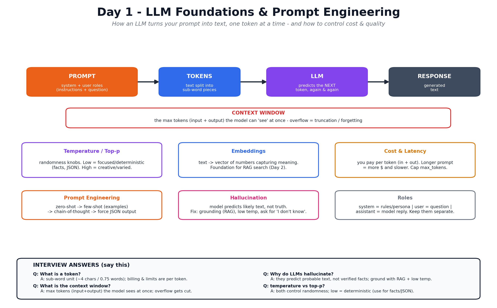

# Day 1 — LLM Foundations & Prompt Engineering

Notes for Day 1 of the [LLMOps 5-Day Learning Plan](../LLMOps-5-Day-Learning-Plan.md).

> **Big-picture analogy:** An LLM is a **super-well-read intern** who has skimmed most
> of the internet. It's great at language, but it **only remembers what's in front of
> it right now** (the context window), sometimes **makes things up confidently**
> (hallucination), and you pay it **by the word** (tokens). Day 1 is about learning to
> **talk to this intern clearly and cheaply.**

## Visual overview (interview-focused)

## Topics
1. [What is an LLM?](01-what-is-an-llm.md) — tokens, context window, how it predicts, hallucination.
2. [Model Settings](02-model-settings.md) — temperature, top-p, max tokens, roles (system/user).
3. [Embeddings](03-embeddings.md) — turning text into meaning-numbers (foundation for RAG).
4. [Prompt Engineering](04-prompt-engineering.md) — few-shot, chain-of-thought, structured output.
5. [Calling LLM APIs & Cost](05-calling-apis-and-cost.md) — API basics, tokens = money, latency.

## Day 1 Goals
- [ ] Explain tokens, context window, and why LLMs hallucinate.
- [ ] Know what temperature/top-p do and when to change them.
- [ ] Understand embeddings at a high level.
- [ ] Write good prompts (few-shot, CoT, JSON output).
- [ ] Call an LLM API and estimate cost from tokens.
