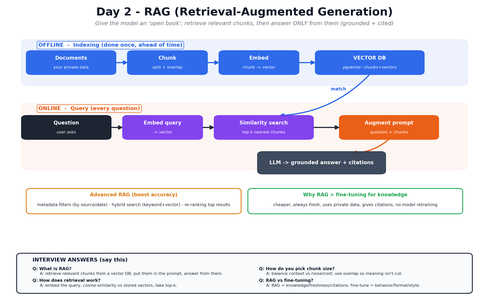

# Day 2 — RAG (Retrieval-Augmented Generation)

Notes for Day 2 of the [LLMOps 5-Day Learning Plan](../LLMOps-5-Day-Learning-Plan.md).

> **Big-picture analogy:** Yesterday's intern answers from memory and sometimes makes
> things up. **RAG gives the intern an open book** before they answer: "here are the
> exact pages relevant to the question — now reply using **only these**." Result:
> grounded, up-to-date answers with **citations** and fewer hallucinations.

## Visual overview (interview-focused)

## Topics
1. [Why RAG?](01-why-rag.md) — the problems RAG solves (private data, freshness, hallucination).
2. [Embeddings & Vector Databases](02-vector-databases.md) — storing and searching meaning.
3. [Chunking](03-chunking.md) — cutting documents into the right-sized pieces.
4. [The RAG Pipeline](04-rag-pipeline.md) — chunk → embed → store → retrieve → augment → generate.
5. [Advanced RAG](05-advanced-rag.md) — metadata filters, hybrid search, re-ranking.

## Day 2 Goals
- [ ] Explain why RAG beats "just prompting" for knowledge questions.
- [ ] Understand vector databases and similarity search.
- [ ] Chunk documents sensibly (size + overlap).
- [ ] Build a working RAG pipeline over your own docs.
- [ ] Improve it with metadata filters, hybrid search, and re-ranking.
