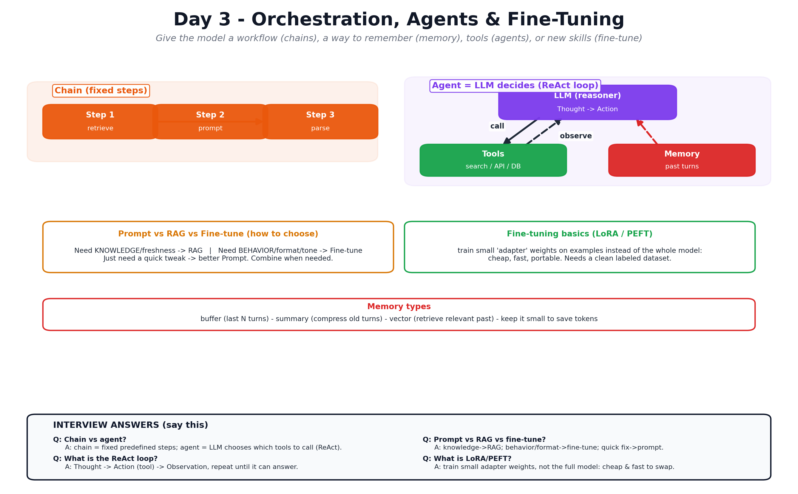

# Day 3 — Orchestration, Agents & Fine-Tuning

Notes for Day 3 of the [LLMOps 5-Day Learning Plan](../LLMOps-5-Day-Learning-Plan.md).

> **Finding this hard?** Read the plain-English walkthrough first:
> [Days 3–5 Explained Simply](../Days-3-4-5-Explained-Simply.md) — one story, everyday analogies, interview one-liners.

> **Big-picture analogy:** So far the intern can talk (Day 1) and read the right notes
> (Day 2). Today we give them a **workflow and tools**: a way to **remember the
> conversation** (memory), a set of **gadgets to use** (tools/agents), and — if needed —
> **send them to a training course** to permanently change how they work (fine-tuning).

## Visual overview (interview-focused)

## Topics
1. [Orchestration Frameworks](01-orchestration-frameworks.md) — LangChain & LlamaIndex, chains.
2. [Memory](02-memory.md) — making multi-turn conversations work.
3. [Agents & Tools](03-agents-and-tools.md) — tool/function calling, the ReAct loop.
4. [Prompt vs RAG vs Fine-Tuning](04-prompt-vs-rag-vs-finetune.md) — how to choose.
5. [Fine-Tuning Basics](05-fine-tuning-basics.md) — datasets, LoRA/PEFT, when it's worth it.

## Day 3 Goals
- [ ] Know what orchestration frameworks do and when to use them.
- [ ] Add memory to make a chatbot multi-turn.
- [ ] Understand agents, tools, and their risks.
- [ ] Decide between prompting, RAG, and fine-tuning for a given problem.
- [ ] Understand fine-tuning basics (LoRA/PEFT) and dataset prep.
