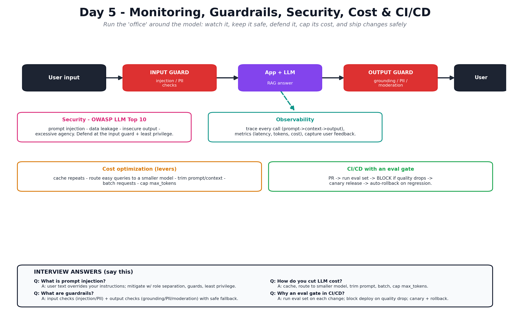

# Day 5 — Monitoring, Guardrails, Security, Cost & CI/CD

Notes for Day 5 of the [LLMOps 5-Day Learning Plan](../LLMOps-5-Day-Learning-Plan.md).

> **Finding this hard?** Read the plain-English walkthrough first:
> [Days 3–5 Explained Simply](../Days-3-4-5-Explained-Simply.md) — one story, everyday analogies, interview one-liners.

> **Big-picture analogy:** The intern is deployed and working. Now we run the **office
> around them**: **CCTV + dashboards** to see how they're doing (observability),
> **safety rules** so they don't say something harmful (guardrails), a **security team**
> guarding against tricksters (prompt injection), a **budget** (cost control), and a
> **review-before-promotion process** (CI/CD with eval gates).

## Visual overview (interview-focused)

## Topics
1. [Observability](01-observability.md) — tracing, metrics, feedback (Langfuse/LangSmith).
2. [Guardrails & Safety](02-guardrails-and-safety.md) — moderation, grounding, PII.
3. [Security (OWASP LLM Top 10)](03-security-owasp.md) — prompt injection & friends.
4. [Cost Optimization](04-cost-optimization.md) — caching, model routing, batching.
5. [CI/CD & Putting It Together](05-cicd-and-putting-together.md) — eval gates + full picture.

## Day 5 Goals
- [ ] Add tracing + metrics + user feedback to your app.
- [ ] Add input/output guardrails and grounding checks.
- [ ] Understand the top LLM security risks and mitigations.
- [ ] Cut cost with caching, model routing, and smaller models.
- [ ] Design a CI/CD pipeline with an evaluation gate.
