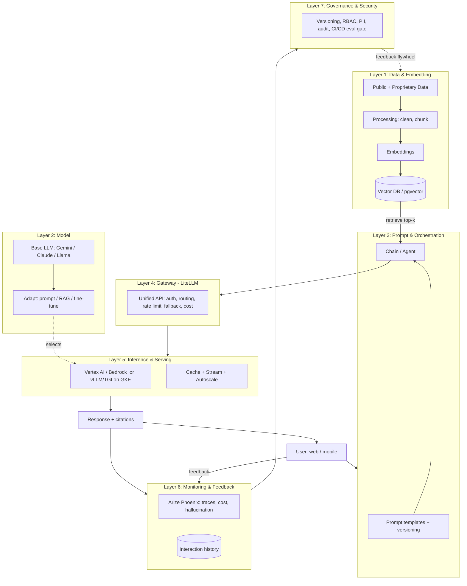

# LLMOps Architecture — A Clear, Layered Explanation

A top-down guide to how a production LLM system is structured: the **layers**, the
**end-to-end data flow**, the common **reference patterns**, and the **tools per layer**
(mapped to your stack). Companion to the [5-Day Plan](LLMOps-5-Day-Learning-Plan.md),
the [`Stack/`](Stack/README.md) notes, and the [`Project/`](Project/README.md) app.

---

## 1. What is LLMOps Architecture?

LLMOps architecture is the **set of layers and components** that take an LLM from a
notebook demo to a **scalable, secure, observable, and maintainable** production system.

It covers the **whole lifecycle**, not just "call a model API":
data → embeddings/retrieval → prompt orchestration → model serving/inference →
gateway/routing → monitoring → governance → feedback.

---

## 2. LLMOps vs MLOps (one table)

| Aspect | Traditional MLOps | LLMOps |
|---|---|---|
| Core work | **Train** custom models, feature engineering | **Orchestrate** pre-trained foundation models |
| Main artifacts | Datasets, trained models | **Prompts, RAG data, model configs** |
| Customization | Full training | **Prompting → RAG → fine-tuning (LoRA/PEFT)** |
| Evaluation | Accuracy/F1 (objective) | **Subjective** (LLM-as-judge, faithfulness, human) |
| Dominant cost | Training compute | **Inference** (tokens / GPU-hours) |
| New risks | Data drift | **Hallucination, prompt injection** |

> One-liner: **MLOps is training-heavy; LLMOps is orchestration-heavy.**

---

## 3. The Layers of LLMOps Architecture

Think of the system as **7 stacked layers**. Each has one job.

### Layer 1 — Data & Embedding Layer
Sources and prepares knowledge for the model.
- Collect data (docs, wikis, CRM, tickets), **clean/normalize**, **chunk**, and convert to
  **embeddings**, stored in a **vector database** for similarity search.
- Track **data versioning/lineage** so results are reproducible.
- *In your stack:* documents → chunk → embed (via LiteLLM) → **Postgres + pgvector**.

### Layer 2 — Model Layer (Selection & Adaptation)
Chooses and customizes the "brain."
- Pick a base model (Gemini, Claude, Llama…), then adapt via **prompting → RAG →
  fine-tuning** (LoRA/PEFT to cut cost).
- Benchmark candidates before committing.
- *In your stack:* **Vertex AI (Gemini)** and **Bedrock (Claude)** as the model options.

### Layer 3 — Prompt & Orchestration Layer
Controls *how* the model is used.
- **Prompt templates + versioning**, chains, memory, and (when needed) **agents/tools**.
- Orchestrates multi-step flows: retrieve → format prompt → call model → post-process.
- *In your stack:* prompt management (versioned prompts in Postgres) + your app's RAG chain.

### Layer 4 — Gateway Layer (the heart)
A single front door to all models.
- **Unified API** to every provider; handles **auth, routing, rate limits/quotas,
  batching, fallback/A-B routing**, and **cost/latency metrics** before hitting inference.
- Decouples app code from providers (swap/fallback without rewrites).
- *In your stack:* **LiteLLM** (routes Vertex AI ⇄ Bedrock, tracks cost, fallback).

### Layer 5 — Inference & Serving Layer
Runs the model and returns tokens.
- Optimized APIs, **token streaming**, **caching**, **quantization**, **autoscaling on
  GPUs** (for self-hosted), plus A/B testing, rollback, multi-model routing.
- *In your stack:* hosted inference on Vertex AI/Bedrock (or self-host with **vLLM/TGI on
  GKE** if you need GPUs/privacy).

### Layer 6 — Monitoring, Feedback & Observability Layer
Watches quality, cost, and behavior.
- **Tracing** (prompt → context → response), dashboards (latency, tokens, cost),
  **hallucination/drift** tracking, and **user feedback** capture for RLHF/retraining.
- *In your stack:* **Arize Phoenix** (+ interaction history in Postgres).

### Layer 7 — Governance, Security & Lifecycle Layer
Keeps it safe, compliant, reproducible.
- **Prompt/model versioning, audit trails, access control (RBAC), PII handling,
  encryption**, compliance (GDPR/HIPAA/SOC 2), guardrails, and **CI/CD with eval gates**.
- *In your stack:* secrets management, guardrails, eval-gated deploys, audit via history.

---

## 4. Architecture Diagram (visual overview)

### The data flow in words (end to end)
1. **Data** is collected, cleaned, **chunked**, embedded, and stored in a **vector DB**.
2. A **base model** is selected and adapted (prompting/RAG/fine-tune).
3. A **user** sends a prompt to the **orchestration layer**, which **retrieves** relevant
   chunks and builds a grounded prompt using a **versioned template**.
4. The **gateway (LiteLLM)** authenticates, routes, and forwards the call (with fallback).
5. The **inference layer** (Vertex AI/Bedrock or self-hosted) generates the answer, with
   caching/streaming.
6. The **response + citations** go back to the user.
7. **Monitoring** captures traces, cost, and **user feedback**; **governance** enforces
   versioning/security and feeds a **flywheel** back into data/prompts.

---

## 5. Reference Architecture Patterns

Pick the pattern that matches your scale, domain, and compliance needs.

| Pattern | What it is | Best for |
|---|---|---|
| **API-Centric** | Pre-trained model behind a REST API, versioned prompts, minimal orchestration | Early-stage, summarization, basic chat |
| **RAG** | LLM + vector DB retrieval for grounded, cited answers | Support bots, enterprise search, docs Q&A |
| **LLM + Workflow Orchestration** | Multi-step chains/agents (LangChain/LangGraph) with tools | Copilots, agentic/multi-turn apps |
| **Fine-Tuned Private LLM** | Fine-tuned open model self-hosted in your VPC | Healthcare, finance, defense (sensitive data) |
| **Hybrid Cloud-Edge** | Big model in cloud, light logic on edge devices | IoT, automotive, mobile (low latency) |

> **Your DocsBot** = the **RAG pattern** with an **API-centric** front and a **gateway**.

---

## 6. Tools by Layer (mapped to your stack)

| Layer | Generic tools | Your stack |
|---|---|---|
| **1. Data & Embedding** | LlamaIndex, Weaviate, Pinecone | **Postgres + pgvector**, LiteLLM embeddings |
| **2. Model** | GPT, Gemini, Claude, Llama; LoRA/PEFT | **Vertex AI (Gemini)**, **Bedrock (Claude)** |
| **3. Prompt & Orchestration** | LangChain, LangGraph | Prompt mgmt (Postgres) + app RAG chain |
| **4. Gateway** | LiteLLM, Portkey, Kong AI, TrueFoundry | **LiteLLM** (routing, fallback, cost, keys) |
| **5. Inference & Serving** | vLLM, TGI, KServe; Cloud Run / GKE | Vertex AI/Bedrock (hosted) or vLLM on GKE |
| **6. Monitoring & Feedback** | Arize, Langfuse, LangSmith | **Arize Phoenix** + interaction history |
| **7. Governance & Automation** | MLflow, GitOps CI/CD | Secrets, guardrails, eval-gated CI/CD |

> **Key idea:** modern LLMOps stacks are **composable** — pick one tool per layer that
> integrates well, rather than one giant end-to-end product.

---

## 7. How this maps to your DocsBot project

| Architecture layer | DocsBot file | 
|---|---|
| Data & Embedding | `ingest.py` → `db.py` (pgvector) |
| Model | Vertex AI / Bedrock via LiteLLM |
| Prompt & Orchestration | `prompts.py` + `rag.py` |
| Gateway | LiteLLM in `rag.py` / `config.yaml` |
| Inference & Serving | `rag.generate()`; deploy via `Dockerfile` + `k8s/` |
| Monitoring & Feedback | `tracing.py` (Phoenix) + `history.py` |
| Governance & Security | `guardrails.py` + `evaluate.py` (eval gate) |

---

## 8. TL;DR

- LLMOps architecture = **7 layers**: Data/Embedding → Model → Prompt/Orchestration →
  **Gateway** → Inference/Serving → Monitoring/Feedback → Governance/Security.
- **Flow:** data → embeddings → retrieve → prompt → **gateway** → inference → response →
  monitor → govern → **feedback flywheel**.
- **LLMOps ≠ MLOps:** orchestration-heavy (prompts/RAG) vs training-heavy.
- **Patterns:** API-centric, **RAG**, workflow/agents, fine-tuned private, hybrid edge.
- **Your stack per layer:** pgvector (data) · Vertex AI/Bedrock (model) · prompt mgmt
  (orchestration) · **LiteLLM** (gateway) · hosted/vLLM (inference) · **Phoenix**
  (monitoring) · guardrails + eval CI/CD (governance).
